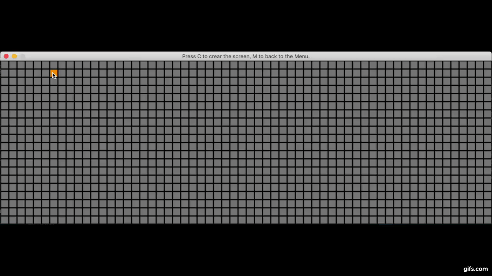

# Visualizing Path Finding Algorithms and Maze Generation

## Objective:
### Use Pygame to visualize path finding algorithms and maze generation:

### 1. Path finding algrithms:
##### - Dijkstra's algorithm
##### - A*
##### - Depth First Search

### 2. Maze Generation:
##### - Randomized Depth First Search
##### - Recursive Divison
##### - Randomly Generate Obstacles

## How to use:
##### install libraries: pip install -r requirements.txt
##### run: python app.py

## Demo: https://youtu.be/I4dEXJq-kPw
